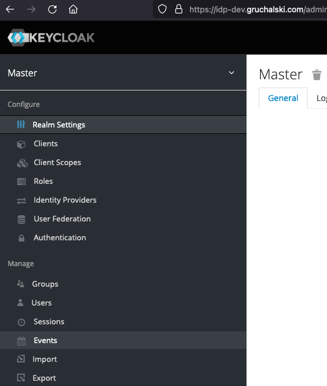
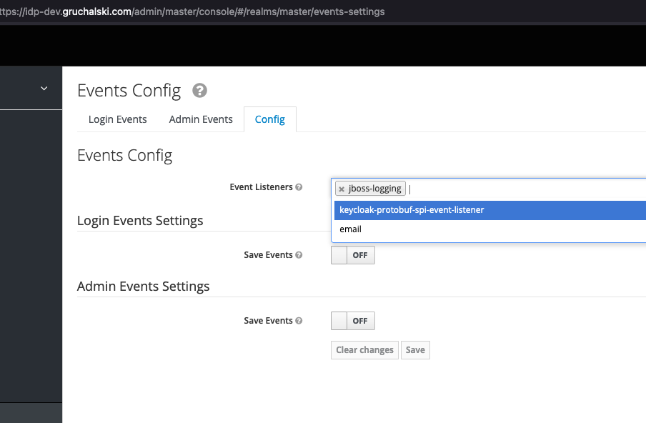
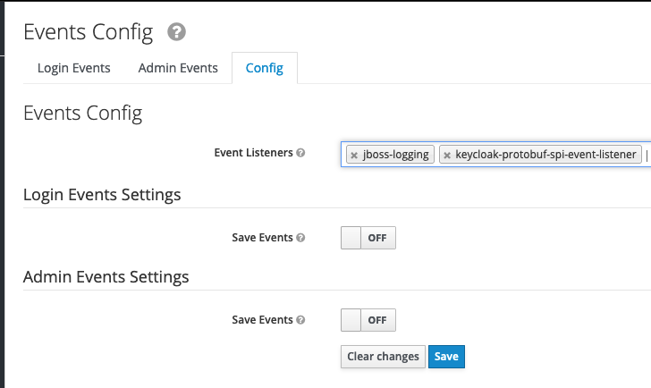

# Keycloak with protobuf event listener SPI

This is a reference Keycloak behind Envoy proxy and a protobuf event listener SPI.

## Configure from zero

### Let's Encrypt certificates

A good introduction to this part is this article from my blog: [Keycloak 17.0.0 with TLS in Docker compose behind Envoy proxy](https://gruchalski.com/posts/2022-02-20-keycloak-1700-with-tls-behind-envoy/).

Essentially:

- Add `127.0.0.1    idp-dev.gruchalski.com` to `/etc/hosts` file.
- Using the LEGO client, generate certificates, I'm using AWS Route53 as a provider: `make certificates`.

### Create a certificate authority

I'm using certstrap here, install certstrap locally. On macOS it is as simple as `brew install certstrap`. Next, generate the CA:

```sh
make init-ca
```

### Generate certificates for the gRPC server

```sh
make cert-event-server
```

This certificate is used by the `keycloak-protobuf-event-server` container.

### Generate certificates for the gRPC client

```sh
make cert-event-client
```

This certificate is used by the Keycloak SPI from inside of Keycloak.

### Build the `keycloak-protobuf-event-server` Docker image

```sh
mkdir -p /tmp/keycloak-protobuf-event-server
cd /tmp/keycloak-protobuf-event-server
git clone https://github.com/radekg/keycloak-protobuf-event-server.git .
make docker.build
cd -
```

### Built the local Keycloak image

```sh
make docker.image.keycloak
```

This may take a while because the SPI has to be compiled with Maven. Downloading Java dependencies may take a bit, depends on your internet connection quality.

## Start

```sh
docker-compose -f compose.yaml up
```

Navigate to https://idp-dev.gruchalski.com and log in top Keycloak. Username `admin`, password `admin`.

## Enable the protobuf event listener in Keycloak

1. In realm management, navigate to Events.



2. Switch to the _Config_ tab and click in the _Event Listeners_ field, a dropdown will appear.



3. Select the `keycloak-protobuf-event-listener` and click _Save_.



In the terminal, you should see output similar to:

```
dev_keycloak                      | 2022-06-12 19:51:33,659 INFO  [keycloak.protobuf.spi.eventlistener.Factory] (executor-thread-1) keycloak-protobuf-spi-event-listener: configuring channel with TLS
dev_keycloak                      | 2022-06-12 19:51:33,660 INFO  [keycloak.protobuf.spi.eventlistener.Factory] (executor-thread-1) keycloak-protobuf-spi-event-listener: configuring TLS trust manager
dev_keycloak                      | 2022-06-12 19:51:33,936 INFO  [keycloak.protobuf.spi.eventlistener.Factory] (executor-thread-1) keycloak-protobuf-spi-event-listener: TLS cert and key file given, setting up key manager
dev_keycloak                      | 2022-06-12 19:51:34,135 INFO  [keycloak.protobuf.spi.eventlistener.Factory] (executor-thread-1) keycloak-protobuf-spi-event-listener: building the channel
dev_keycloak                      | 2022-06-12 19:51:34,183 INFO  [keycloak.protobuf.spi.eventlistener.Factory] (executor-thread-1) keycloak-protobuf-spi-event-listener: channel built
dev_keycloak                      | 2022-06-12 19:51:34,183 INFO  [keycloak.protobuf.spi.eventlistener.Factory] (executor-thread-1) keycloak-protobuf-spi-event-listener: creating new blocking stub
keycloak-protobuf-event-server_1  | 2022-06-12T19:51:34.487Z [INFO]  keycloak-protobuf-event-server: OnAdminEvent: admin-event="time:1655063494188  realmId:{value:\"d749d1c4-d60d-4541-926b-f12efe131982\"}  authDetails:{realmId:{value:\"d749d1c4-d60d-4541-926b-f12efe131982\"}  clientId:{value:\"b0e3dfcf-2821-4a1b-ac26-2c82ad059414\"}  userId:{value:\"8fb5844f-9af7-4684-a59b-5d40a0c4a72a\"}  ipAddress:{value:\"172.18.0.4\"}}  resourceType:{value:\"REALM\"}  operationType:UPDATE  resourcePath:{value:\"events/config\"}  representation:{value:\"{\\\"eventsEnabled\\\":false,\\\"eventsListeners\\\":[\\\"jboss-logging\\\",\\\"keycloak-protobuf-spi-event-listener\\\"],\\\"enabledEventTypes\\\":[\\\"LOGIN\\\",\\\"LOGIN_ERROR\\\",\\\"REGISTER\\\",\\\"REGISTER_ERROR\\\",\\\"LOGOUT\\\",\\\"LOGOUT_ERROR\\\",\\\"CODE_TO_TOKEN\\\",\\\"CODE_TO_TOKEN_ERROR\\\",\\\"CLIENT_LOGIN\\\",\\\"CLIENT_LOGIN_ERROR\\\",\\\"FEDERATED_IDENTITY_LINK\\\",\\\"FEDERATED_IDENTITY_LINK_ERROR\\\",\\\"REMOVE_FEDERATED_IDENTITY\\\",\\\"REMOVE_FEDERATED_IDENTITY_ERROR\\\",\\\"UPDATE_EMAIL\\\",\\\"UPDATE_EMAIL_ERROR\\\",\\\"UPDATE_PROFILE\\\",\\\"UPDATE_PROFILE_ERROR\\\",\\\"UPDATE_PASSWORD\\\",\\\"UPDATE_PASSWORD_ERROR\\\",\\\"UPDATE_TOTP\\\",\\\"UPDATE_TOTP_ERROR\\\",\\\"VERIFY_EMAIL\\\",\\\"VERIFY_EMAIL_ERROR\\\",\\\"VERIFY_PROFILE\\\",\\\"VERIFY_PROFILE_ERROR\\\",\\\"REMOVE_TOTP\\\",\\\"REMOVE_TOTP_ERROR\\\",\\\"GRANT_CONSENT\\\",\\\"GRANT_CONSENT_ERROR\\\",\\\"UPDATE_CONSENT\\\",\\\"UPDATE_CONSENT_ERROR\\\",\\\"REVOKE_GRANT\\\",\\\"REVOKE_GRANT_ERROR\\\",\\\"SEND_VERIFY_EMAIL\\\",\\\"SEND_VERIFY_EMAIL_ERROR\\\",\\\"SEND_RESET_PASSWORD\\\",\\\"SEND_RESET_PASSWORD_ERROR\\\",\\\"SEND_IDENTITY_PROVIDER_LINK\\\",\\\"SEND_IDENTITY_PROVIDER_LINK_ERROR\\\",\\\"RESET_PASSWORD\\\",\\\"RESET_PASSWORD_ERROR\\\",\\\"RESTART_AUTHENTICATION\\\",\\\"RESTART_AUTHENTICATION_ERROR\\\",\\\"IDENTITY_PROVIDER_LINK_ACCOUNT\\\",\\\"IDENTITY_PROVIDER_LINK_ACCOUNT_ERROR\\\",\\\"IDENTITY_PROVIDER_FIRST_LOGIN\\\",\\\"IDENTITY_PROVIDER_FIRST_LOGIN_ERROR\\\",\\\"IDENTITY_PROVIDER_POST_LOGIN\\\",\\\"IDENTITY_PROVIDER_POST_LOGIN_ERROR\\\",\\\"IMPERSONATE\\\",\\\"IMPERSONATE_ERROR\\\",\\\"CUSTOM_REQUIRED_ACTION\\\",\\\"CUSTOM_REQUIRED_ACTION_ERROR\\\",\\\"EXECUTE_ACTIONS\\\",\\\"EXECUTE_ACTIONS_ERROR\\\",\\\"EXECUTE_ACTION_TOKEN\\\",\\\"EXECUTE_ACTION_TOKEN_ERROR\\\",\\\"CLIENT_REGISTER\\\",\\\"CLIENT_REGISTER_ERROR\\\",\\\"CLIENT_UPDATE\\\",\\\"CLIENT_UPDATE_ERROR\\\",\\\"CLIENT_DELETE\\\",\\\"CLIENT_DELETE_ERROR\\\",\\\"CLIENT_INITIATED_ACCOUNT_LINKING\\\",\\\"CLIENT_INITIATED_ACCOUNT_LINKING_ERROR\\\",\\\"TOKEN_EXCHANGE\\\",\\\"TOKEN_EXCHANGE_ERROR\\\",\\\"OAUTH2_DEVICE_AUTH\\\",\\\"OAUTH2_DEVICE_AUTH_ERROR\\\",\\\"OAUTH2_DEVICE_VERIFY_USER_CODE\\\",\\\"OAUTH2_DEVICE_VERIFY_USER_CODE_ERROR\\\",\\\"OAUTH2_DEVICE_CODE_TO_TOKEN\\\",\\\"OAUTH2_DEVICE_CODE_TO_TOKEN_ERROR\\\",\\\"AUTHREQID_TO_TOKEN\\\",\\\"AUTHREQID_TO_TOKEN_ERROR\\\",\\\"PERMISSION_TOKEN\\\",\\\"DELETE_ACCOUNT\\\",\\\"DELETE_ACCOUNT_ERROR\\\"],\\\"adminEventsEnabled\\\":false,\\\"adminEventsDetailsEnabled\\\":false}\"}  error:{noValue:{}}"
```

This indicates that thinfs started correctly.
